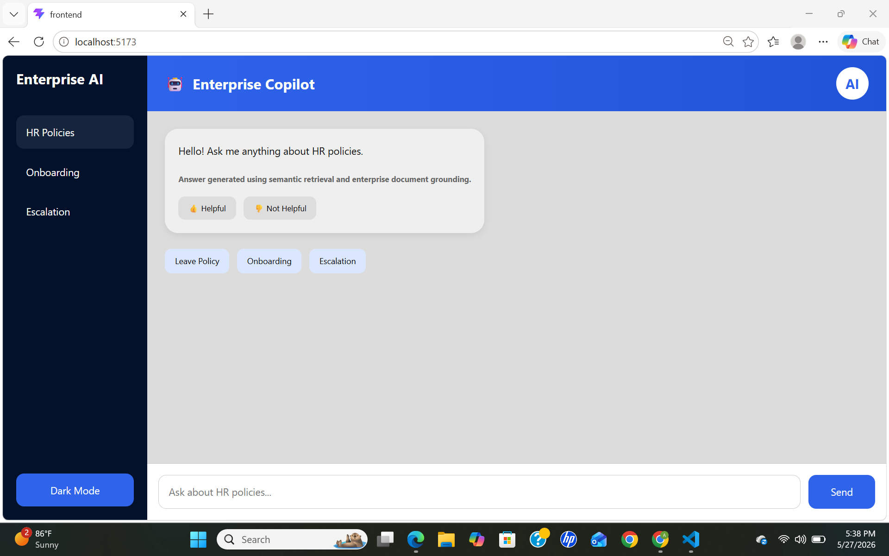
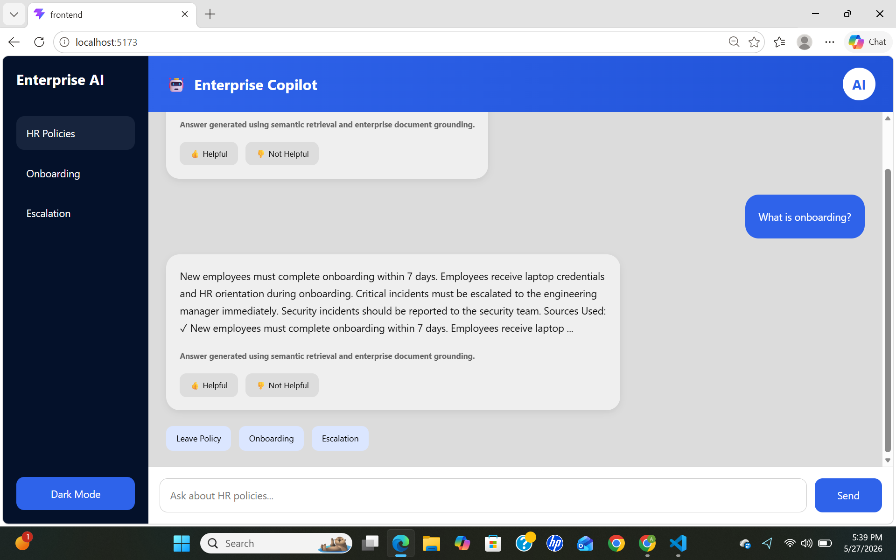

# Enterprise AI Copilot

A lightweight enterprise AI copilot built using React, FastAPI, OpenAI, and ChromaDB.

This project was designed to simulate how internal enterprise AI assistants work using semantic retrieval and grounded LLM responses.

The application allows employees to ask HR-related questions in natural language and receive AI-generated responses grounded using enterprise policy documents.

---

# Motivation

The goal of this project was to explore practical AI-assisted enterprise workflows rather than building a generic chatbot UI.

I wanted to focus on:

* semantic retrieval pipelines
* retrieval-augmented generation (RAG)
* enterprise-style conversational UX
* AI orchestration patterns
* grounded LLM responses
* fullstack AI application architecture

---

# Core Features

* Enterprise HR copilot interface
* Semantic search using vector embeddings
* Retrieval-Augmented Generation (RAG)
* OpenAI-powered response generation
* ChromaDB vector database
* FastAPI backend APIs
* React frontend
* Suggested prompt workflows
* Explainability / source grounding
* Human feedback controls
* Enterprise dashboard-style UI

---

# Architecture Overview

The application follows a lightweight RAG architecture:

User Query
↓
React Frontend
↓
FastAPI Backend
↓
SentenceTransformer Embeddings
↓
ChromaDB Semantic Retrieval
↓
Relevant HR Context Retrieval
↓
OpenAI GPT Response Generation
↓
Grounded Enterprise Response

---

# How Retrieval Works

1. User submits a query from the frontend.
2. Backend converts the query into embeddings.
3. ChromaDB performs semantic similarity search.
4. Relevant HR documents are retrieved.
5. Retrieved context is injected into the LLM prompt.
6. OpenAI generates a grounded response.
7. Response is displayed along with source visibility.

This helps reduce hallucinations by constraining responses using enterprise documents.

---

# Tech Stack

## Frontend

* React
* Vite
* TypeScript
* CSS

## Backend

* Python
* FastAPI
* Uvicorn

## AI / Retrieval

* OpenAI API
* Sentence Transformers
* ChromaDB
* Vector Embeddings
* Semantic Search

---

# Example Queries

* What is onboarding?
* Explain escalation process
* What is the leave policy?
* Who handles security incidents?

---

# Project Structure

```bash
enterprise-ai-copilot/
│
├── backend/
│   ├── documents/
│   ├── main.py
│   ├── rag.py
│   ├── requirements.txt
│   └── .env
│
├── frontend/
│   ├── src/
│   └── package.json
│
├── screenshots/
│
├── README.md
└── .gitignore
```

---

# Local Setup

## Backend

```bash
cd backend

python -m venv venv

venv\Scripts\activate

pip install -r requirements.txt

uvicorn main:app --reload
```

Backend runs on:

```bash
http://127.0.0.1:8000
```

---

## Frontend

```bash
cd frontend

npm install

npm run dev
```

Frontend runs on:

```bash
http://localhost:5173
```

---

# Environment Variables

Create `.env` inside backend:

```env
OPENAI_API_KEY=your_openai_api_key
```

---

# Screenshots

## Dashboard



## Onboarding Workflow


## Escalation Workflow



---

# Design Decisions

Some intentional design decisions made during development:

* Used semantic retrieval instead of keyword search
* Added source visibility for explainability
* Focused on grounded AI responses
* Kept the UI enterprise-oriented instead of consumer-chatbot themed
* Added lightweight human feedback controls
* Prioritized practical AI orchestration over model training

---

# Future Improvements

Potential future enhancements:

* Multi-turn conversation memory
* Streaming AI responses
* Authentication and RBAC
* PDF ingestion pipelines
* Admin document upload portal
* Response evaluation metrics
* Prompt/version observability
* Persistent vector database storage

---

# What This Project Demonstrates

* Fullstack AI application development
* RAG architecture implementation
* AI workflow orchestration
* Semantic retrieval systems
* Vector database integration
* FastAPI API development
* React frontend engineering
* Enterprise AI UX concepts

---

# Author

Built by Pallavi P as part of an AI-driven fullstack engineering assignment focused on enterprise AI assistant workflows.
